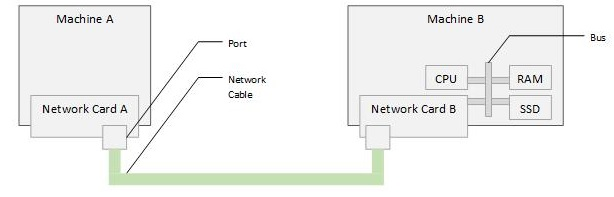
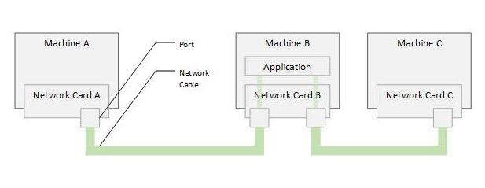

# Connecting Computers

To transfer data between two computers, a device need to convert the data from
its digital form to an analog signal matching the medium that will be used to
transfer the signal. That device is the network card or network adapter.

A network card will connected on one end with the data bus on the motherboard
and on the other to the medium - for simplicity, let's assume it is an ethernet
cable.



[Figure A](./connecting-computers-a.jpg)

If there were only two computers to connect, then one could envision a scenario
where the cable has multiple wires - some for sending data and some for receiving
data - and that way both network cards can communicate at the same time without
much complexity.

If Network Card A receives data, it must be coming from Network Card B. If it
sends data, it must go to Networkd Card B.

At some point in the distant past, we connected two computers that way over
the serial port and played Doom!

You could connect a third machine C to the two if you install a network card
with two ports on, let's say, machine B. Then you can connect A to B port 1,
and C to B port 2 - and then if A wants to send data to C, it sends the data to
B, B receives it on port 1 and realizes that it is meant for C. B, then,
re-sends the data to C through port 2.

This does not scale at all.

The first problem is that a large number of machines will be involved if one
machine wants to talk to another on the other end of the group.



[Figure B](./connecting-computers-b.jpg)

Note that the scenario above mandates that when Machine A sends something to
Machine B, it needs to indicate whether what it is sending is intended for
Machine B or for Machine C. The same thing when Machine C sends something to
Machine B.

That 'indication' is typically the machine identity - but what is the machine
identity? Well, it can be anything that uniquely identifies the destination of
the data - it can be its network card id, it can be the machine name, or it can
be something completely different.

It is standard now that each network adapter has a universally unique
identifier associated with the hardware itself. This identifier is guaranteed
to be always unique - and it is called the `MAC address`, or the Machine Access
Control address.

**But wait** - the network card with two ports seem like an over kill! There are
definitely better solutions!

Let's see how we can improve this using the [Network Hub](../02-the-network-hub/the-network-hub.md).

## Command Reference

On Windows, you can find the MAC address of the network card on your computer
by running the below command and looking for the `Physical Address` in the
output:

```bash
ipconfig /all
...
Ethernet adapter vEthernet (Private):
...
 Physical Address. . . . . . . . . : 00-11-22-33-44-55
...
```

On Azure Linux, you can achieve the same by running the below command and
looking for the `link/ether` in the output:

```bash
ip a
...
link/ether 00:11:22:33:44:55
...
```