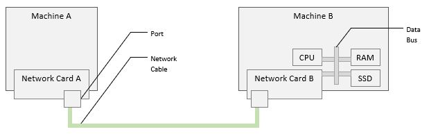
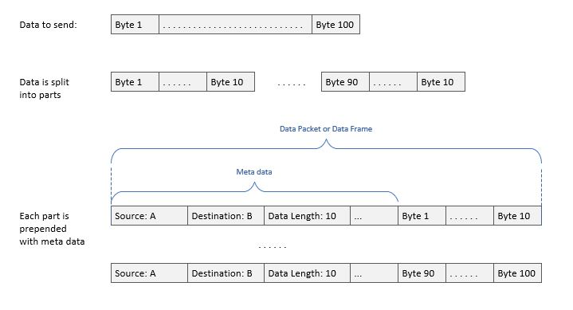
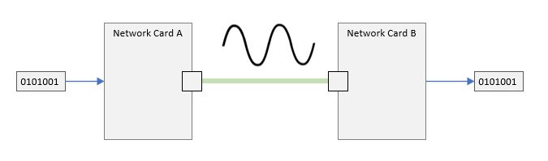

# Connecting Two Computers

To transfer data between two computers, we need a device to convert a stream
of bytes into a signal matching the medium that will be used for the transfer.
That device is the **network card** or **network adapter**.

A network card is connected on one end with the data bus on the motherboard
and on the other to the physical medium - for example, to a network cable.

The connection between the network adapter and the cable is called a port. A
network adapter may have one or more ports (and are typically numbered from 1
to n; where n is the number of ports).

[Figure A](./connecting-two-computers.jpg)

Before the data is converted to the transfer signal, it is split into smaller
parts - where each part gets tagged with meta data describing where it is
coming from and where it is heading - along with other information. This new
combination is called a **data frame** or a **data packet**. This is the unit
of sending and receiving in computer networking.

[Figure B](./network-frame.jpg)

Then, the network adapter converts that stream of bytes to the transfer signal
on the transfer medium. A receiver network adapter converts the signal back to
a stream of bytes matching the original.

[Figure C](./digital-to-analog.jpg)

Typically, there is a protocol for the network cards sharing the same physical
medium that orchestrates when each network card can place its signal on the
medium. This orchestration is beyond the scope of this article series though.

In the above very simple topology, if Network Card A receives data, it must be
coming from Network Card B. If it sends data, it must be going to Network Card
B. The notion of sender/receiver identity is implied by the physical wiring.

But what happens when we want to connect a third computer?

Let's see how this will look like in our next article!

----

[Main Page](../README.md) | [Next: Connecting Multiple Computers](../02-connecting-multiple-computers/connecting-multiple-computers.md)