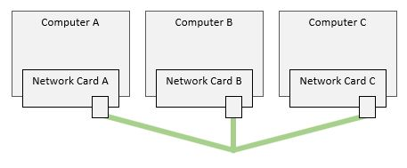
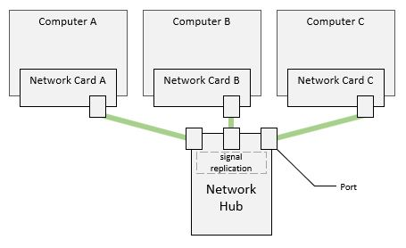

# Connecting Multiple Computers

Connecting multiple computers together such that any computer can send and
receive from any other computer involves a number of problems to solve. The
first problem is how we should physically connect the computers. And the second
problem is that how do we make sure the data is sent to and processed by the
intended destination in an efficient way.

## Physically Connecting Multiple Computers

If we consider the electricity wiring in our home, then, we know we can 'split'
the power line and that will allow us to plug-in more appliances to the same
power outlet! Of course, this has implications on the voltage and on the power
delivered to each appliance, along with the total power delivered.

We can do the same for our network cables!

[Figure A](./basic-wiring.jpg)

**But wait, can we?!**

It is not that simple. We have to pay attention to the power and the voltages
across all our end-points and ensure that it meets the requirements of the
network adapters for a reliable communication.

To simplify the problem, each network adapter port has been designed to expect
a single receiver/sender on the other end of the wire. So, now, we just need
to design a device that is able to take signals from multiple wires, and
replicate that signal unto one or more wires.

Enter the **network hub**.

[Figure B](./hub-wiring.jpg)

A network hub is a device that has multiple ports, and it can replicate the
signal received from one port unto all the other ports - maintaining the signal
electrical characteristics (voltage, power, etc).

This is great - now, any computer on our network can send data to any other
computer on the same network!

The above topology is considered a signle "Network Segment". A **"Network
Segment"** refers to all the computers that are connected to the same physical
media.

Note also that because of how those computers are connected together, if one
computer emits a signal, all computers on the same network segment will
intercept that signal. Those computers receiving the signal constitute the
**"broadcast domain"** for the sender.

This group of computers along with these connections form a LAN - Local Area
Network.

Note that the signal propagation is purely based on the physical connections -
this is the first level of networking and is called the 'Physical Layer' or
'Layer 1'.

But there is still a catch - because the network hub just replicates the signal
and sends it to all computers on the network, all computers will get the
message. How does a computer know if the message it is receiving is intended
for it?

Let's explore this togther in the next article...

----

[Main Page](../README.md) | [Previous: Connecting Two Computers](../01-connecting-two-computers/connecting-two-computers.md) | [Next: The Hardware Identity](../03-hardware-identity/hardware-identity.md)