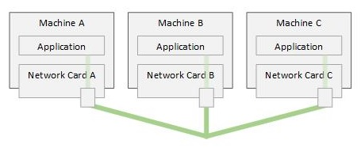
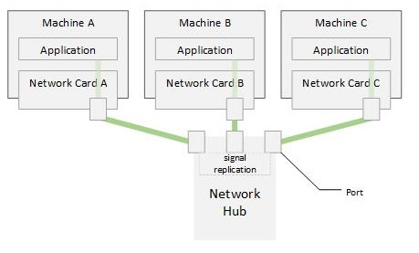

# The Network Hub

From the [previous article](../01-connecting-computers/01-connecting-computers.md),
it seems like an overkill to have to use a network card with two parts to
connect more than two computers. One one end, the network card is more
unnecessarily complicated, and on another, how can this scale to many computers
? It will be very slow to send data from one end of such a chain to the other!

How about we distribute the signal through wiring outside the network card? For
example:

[Figure A](./01-the-network-hub-a.jpg)

Basically, when a signal is emitted from Network Card A, both Network Card B,
and Network Card C will receive the same signal. Then, an application can
decode the signal and decide if the machine it is running on is the intended
destination or not.

Logically - this sounds like a better solution. When it comes to implementation,
 we need to take into account how the signal will be distributed to different
wire branches, and how do keep the power at the right levels so that they are
detectable by the network cards on each connected computer.

So - what we need is a device that replicates any signal that comes in to every
wire branch that goes out. The device need to have its own power so that it can
maintain the right power levels on the wires.

This is what we call a "network hub".

[Figure B](./01-the-network-hub-b.jpg)

The above topology is considered a signle "Network Segment". A **"Network
Segment"** refers to all the computers that are connected to the same physical
media.

Note also that because of how those computers are connected together, if one
computer emits a signal, all computers on the same network segment will
intercept that signal. Those computers receiving the signal constitute the
**"broadcast domain"** for the sender.

So, Network Hubs improve things and allow much better scale. But let's say you
have 100 computers, and they are all heavy users of the network. That would mean
that the wire going to each machine will carry the traffic of the machine it is
connecting to, and the traffic for the 99 other machines! Synchronizing that at
the network card level will be very hard and can lead to resource starvation!
Not only that, but does the traffic from each machine really needs to go to
every other machine on the network? If not, that would mean that each machine
is just getting so much noise!

Note that an 'application' still need to be running on each computer to sort
out whether the data the network card received is really intended for it or not
(since the network card receives all traffic on the network).

Let's see how the networking engineers have solved this problem using the
[Network Switch](../03-the-network-switch/03-the-network-switch.md).

## Definitions

| Term                             | Description                                                                                      |
|----------------------------------|--------------------------------------------------------------------------------------------------|
| Network Hub                      | A device that can replicate network signals unto other wire branches.                            |
| Network Segment                  | A group of computers that share the same physical networking media/wire.                         |
| Boradcast Domain                 | A group of computers that receives the signal by a sender without copying/re-sending the signal. |
| LAN (Local Area Network)         | The group of computers that are on the same network segment.                                     |
| Network Physical Layer (Layer 1) | The physical wire connections of the varios computers on the network.                            |
