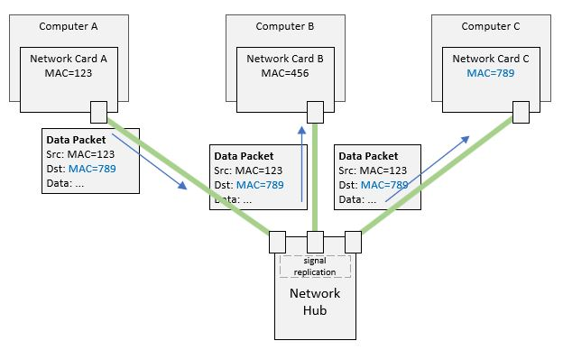

# The Hardware Identity

In the previous article we have talked about how the network hub broadcasts
all incoming communications to all connected computers (excepted the sender,
of course). This guarantees that the intended destination will get the
message, but how does it know the message is intended for it?

To solve this, when the sender machine builds up the data packet, it will
indicate the destination by encoding the destination identity into the packets.
That way, a receiving computer may extract the destination identity from the
packet it receives, compares the extracted identity to its own identity, and
if it matches, it means the packet is intended for that receiving computer.

But what is the identity to use?

In the networking world, there are multiple identities that can be used - each
has its purpose and pros and cons.

The most basic one is the hardware identity of the network adapter embedded by
the manufacturer - called the `MAC address` (Machine Access Control address).
This identity is guaranteed to be universally unique per network adapter/port.

So, if a sender knows the MAC address of its destination, it can encode it into
its data packet, and the receiver will get the message, compare it to its own
MAC address, and then process the data accordingly. The other machines one the
network that got the same message will just ignore it.



[Figure A](./hardware-identity.jpg)

Of course, there is a security risk here. If a rogue machine managed to be
connected to that network, it can listen to all traffic taking place.

The security risk is not the only problem! Let's say you have 100 machines in
the network, and all machine are using the network heavily, how much
unnecessary data is being sent to every single one of them? We could estimate
that each machine is checking incoming data that is almost 99% not meant for it
. That is a significant waste of resources!

Let's see how this can be improved...

## Command Reference

On Windows, you can find the MAC address of the network card on your computer
by running the below command and looking for the `Physical Address` in the
output:

```bash
ipconfig /all
...
Ethernet adapter vEthernet (Private):
...
 Physical Address. . . . . . . . . : 00-11-22-33-44-55
...
```

On Azure Linux, you can achieve the same by running the below command and
looking for the `link/ether` in the output:

```bash
ip a
...
link/ether 00:11:22:33:44:55
...
```

----

[Main Page](../README.md) | [Previous: Connecting Multiple Computers](../02-connecting-multiple-computers/connecting-multiple-computers.md) | [Next: The Network Switch](../04-the-network-switch/the-network-switch.md)