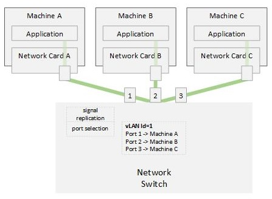

# The Network Switch

From the previous discussion, it is clear that each computer will get way more
network traffic than it needs to get. It is ideal if we can have each computer
on the network see only the traffic that is intended for it. That way, we free
the computer's cycle to do some other than sorting random networking traffic
passing by!

We can achieve that by making our Network Hub more intelligent - that is; make
it inspect the incoming signal and understand its destination, then replicate it
only on the port which has that destination (instead of every other port).

This smarter version of the network hub is called a **network switch**.

Remember the application that we had running on each computer in our [first attempt](../01-connecting-computers/01-connecting-computers.md)
to connect multiple computers? Well, a similar application will need to run on
the network switch. It will inspect the incoming signals, determine their
destination, and replicate the signal on the port that goes to that destination
.

There is a problem though - how does the application know which port leads to
a specific destination? We need a way for computers to advertise who they are
so that the application can build a table of what computer is connected to what
port.

A network card can always encode its identity into the data it is sending
out along with the identity of the destination. When the network switch
receives the data, it can inspect it and know the identity of the sender.
Moreover, it knows which port it came from! This allows the network switch to
build a table of identity and port...

Okay, but how does the network switch know which port to send out the data on?
Well, it cannot - at first. So, it will broadcast the data on all ports. When
the destination network card receives the data, and responds, it will encode
its identity in the response. And again, the network switch creates a new entry
in its table to capture the mapping for future communication. That way, if new
data is being sent to the same destination, the network switch will not need to
broadcast the data to everybody and bother them unnecessarily.

[Figure A](./03-the-network-switch-a.jpg)

Let's do a walkthrough together:

| Event                                              | Switch Port-to-Identity Table              |
|----------------------------------------------------|--------------------------------------------|
|                                                    | &lt;empty&gt;                              |
| Machine A sends data to Machine B                  |                                            |
| Switch receives data from port 1                   |                                            |
| Switch decodes the data                            |                                            |
| Switch decodes the source identity to be Machine A |                                            |
| Switch updates the look-up table                   | Port 1 - Machine A                         |
| Switch broadcasts the data on ports 2 and 3        |                                            |
| Machine B receives the data                        |                                            |
| Machine B forms a response to Machine A            |                                            |
| Machine B sends the data to Machine A              |                                            |
| Switch receives data from port 2                   |                                            |
| Switch decodes the data                            |                                            |
| Switch decodes the source identity to be Machine B |                                            |
| Switch updates the look-up table                   | Port 1 - Machine A  Port 2 - Machine B |
| Switch sends the data on Port 1 (to Machine A)     |                                            |

Okay, now we have seen how the traffic going to each computer got reduced
significantly!

Now that we have a central traffic controller, we can do fancier things!

For example, what if we are designing the network layout for a school where
the student computers should never be able to send (or receive traffic) from
the administration computers - who would we achieve that?

Let's see how this can be solved with [VLANs](../04-vlans/04-vlans.md) in our
next article.

## Definitions

| Term                             | Description                                                                                      |
|----------------------------------|--------------------------------------------------------------------------------------------------|
| Network Switch                   | A device that can replicate network signals unto other wire branches **selectively**.            |
