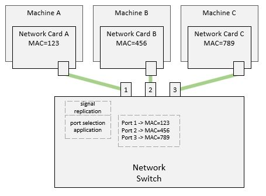

# The Network Switch

From the previous discussion, it is clear that each computer will get way more
network traffic than it needs to get. It would be ideal if we can have each
computer on the network see only the traffic that is intended for it. That way,
we free the computer's cycles to do something other than sorting random network
traffic.

We can achieve that by making our Network Hub more intelligent - that is; by
making it inspect the incoming signal and understand its destination, then
replicate it only on the port which has that destination (instead of on all
ports).

This smarter version of the network hub is called a **network switch**.

To achieve that, an application will need to run on the network switch, inspect
each packet as it comes in, and based on the destination encoded in the packet,
the network switch will replicate the signal on the port that corresponds to
that destination.

There is a problem though - how does that application know which port leads to
a specific destination? We need a way for computers to advertise who they are
so that the application can build a table of what computer is connected to what
port.

A network card can always encode its identity into the data it is sending
out along with the identity of the destination. When the network switch
receives the data, it can inspect it and know the identity of the sender.
Moreover, it knows which port it came from - which allows the network switch to
build a map of identity and ports...

Okay, but how can the network switch know which port to send out the data on?
Well, it cannot - at least at first. Initially, the network switch will have to
broadcast the data on all ports. When the destination responds, the network
switch can inspect the packet as it comes in, note the source, and then use
that information to update its internal identity and port map.

As each computer starts sending out data, the identity and port map will
continue to be grow until all network identities have been mapped, and there is
no more need for broadcasts.

[Figure A](./the-network-switch.jpg)

Let's do a walkthrough together:

| Event                                              | Switch Port-to-Identity Table          |
|----------------------------------------------------|----------------------------------------|
|                                                    | &lt;empty&gt;                          |
| Machine A sends data to Machine B                  |                                        |
| Switch receives the data from port 1               |                                        |
| Switch decodes the source identity to be Machine A |                                        |
| Switch updates its identity/port map               | Port 1 - MAC 123                       |
| Switch broadcasts the data on ports 2 and 3        |                                        |
| Machine B receives the data                        |                                        |
| Machine B forms a response to Machine A            |                                        |
| Machine B sends the response to Machine A          |                                        |
| Switch receives the data from port 2               |                                        |
| Switch decodes the source identity to be Machine B |                                        |
| Switch updates its identity/port map               | Port 1 - MAC 123  Port 2 - MAC 456 |
| Switch sends the data on Port 1 (to Machine A)     |                                        |

This way, a network switch can reduce the traffic going to each computer
significantly!

Now that we have a central traffic controller, we can do fancier things!

For example, what if we are designing the network layout for a school where
the student computers should never be able to send data to the administration
computers - how can we achieve that?

Let's see how to solve this in our next article!

----

[Main Page](../README.md) | [Previous: The Hardware Identity](../03-hardware-identity/hardware-identity.md) | [Next: vLANs](../05-vlans/vlans.md)