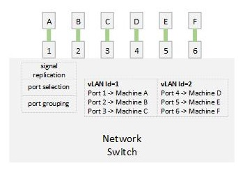

# vLANs

In the [previous article](../03-the-network-switch/03-the-network-switch.md),
our network switch treated all ports and computers equally.

However, if we want to partition our computers into separate groups - where
a computer from a group cannot communicate to a computer from another, then
we have to improve on the network switch we have so far.

One solution is to have two switches - group A connects to switch 1, and group
B connects to switch 2. This can work - but in some cases, that is not
efficient since each of the switches can handle much than what each group has,
more over, what if we want these groups to be configurable via software - not
through actual physical wiring? Then, the two switch solution will not be a
great one.

Enter vLANs - virtual local area networks.

Remember the port-to-identity association table in our last article? We can
program the switch so that a certain identity group cannot talk to another
identity group. However, machines within an identity group can still talk to
each! An identity group is a virtual-LAN - since by definition of a LAN, all
machines within a LAN can talk to each other, likewise, all machines within
a vLAN can talk to each other. The difference is that a vLAN is enforced by
software on top of the hardware the connects the machines - and hence the
'virtual' prefix (as opposed to 'physical').

Typically, each vLan definition is also assigned an identity - i.e. a vLAN ID.
The identity can then be used while configuring it, or while configuring
machines on the network to belong to a specific vLAN.

[Figure A](./04-vlans-a.jpg)

The next problem to solve is how we group machine identities!

Well, in reality, we just need to designate which ports on the network switch
belong to which group. For example, we can say that ports 1-12 belong to group
A while ports 13-24 belong to group B. Which each machine connects, it will
encode its identity and the network switch can build it association tables -
maybe two separate tables in this case.

What if we want to control that group association through software, not through
physical ports?

A possible way is to be able to descibe the identities collectively. For
example, if we can descibe a group as those with a MAC address with a certain
prefix, then the network switch can place a machine in the right group once
it identifies itself.

In reality, however, using MAC for such purpose is not doable because it is
randomly generated and is very hard to find a meaningful pattern among a number
of network cards installed on a LAN.

This is where software assigned identities come into the picture! Those
identities can be shaped with much more flexibility for easier referencing
in the network design!

In our next article, we will talk about software assigned network identities.

Worth of nothing here, that when the switch uses the MAC address for figuring
out how to redirect data to its destination, it is called a Layer 2 routing.

## Definitions

| Term                  | Description                                                                                      |
|-----------------------|--------------------------------------------------------------------------------------------------|
| vLAN                  | A group of machines connected to a switch and isolated by software (running on the switch) from communicating with other physically connected machines to the same switch. |
| vLAN ID               | A software identifier for the vLAN configuration.                                                |
| Layer 2 Communication | Any communication that uses the MAC address of the network adapters to communicate with them.    |
