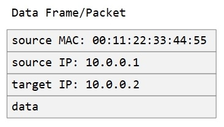

# IP Addresses

In the previous articles we have talked about how computers need an identity
on the network so traffic can be directed to them.

One identity we talked about is the hardware identity of the network card -
a.k.a. MAC address.

When there is a group of computers to manage, it is easier to manage many
networking aspects if we can assign identities that are easy to understand, 
query, and group.

The IP (Internet Protocol) addressing scheme satisfies these requirements by
simply being a range of numbers. The IP scheme has two versions in use IPv4
and IPv6.

In the case of IPv4, the range is specified by 4 bytes where the value of each
byte is separated with a dot from the next value. For example `10.0.0.10` or
`255.255.0.255`.

For the case of IPv6, the range is specified by 16 bytes where the value of
each 2 bytes is written in hexadecimal and is separate with a colon from the
next value. For example `2001:0DB8:AC10:FE01:0000:0000:0000:0001`.

Because these identities are just numbers, you can easily carve ranges - for
example, you can say I will be using the range from 0 to 99 for vLAN 1 and 100
to 199 for vLAN2. The numbers are easy to write and remember, and so are the
ranges!

The networking engineer took a step further when defining the ranges, and
instead of using a 'from x to y' notation, they represent it with how many
bits are reserved for the fixed part of the byte string.

For example, in IPv4 there are 4 bytes which contain 4x8=32 bits. If I want
to define the range 0-3, that means the 2 least significant bits will be
changed to accommodate that range, and the rest (the other 30 bits) will stay
fixed. So, the notation for that range would be `0.0.0.0/30`.

Note that the range does not have to start from 0, for example, you can define:
`10.0.0.0/30` - and that will mean the addresses:
- `10.0.0.0`
- `10.0.0.1`
- `10.0.0.2`
- `10.0.0.3`

Another way of expressing the range is "Subnet Mask" - where create a mask of the
same size as the IP adddressing scheme, and then we set the bits to be fixed 1s.
For example, `255.255.240.0` transaltes to `11111111.11111111.11110000.00000000`,
which means the first 20 bits will be fixed, and last 12 bits will change.

Note that this notation does not say what the fixed part is - it just say which
bits are fixed. For example: if the subnet mask is `255.255.240.0`, and we know
that IP `172.21.224.1` belongs to that range, then:

```
Subnet Mask: 255.255.240.0  11111111.11111111.11110000.00000000
                            |------- fixed ------||--variable-|
IP         : 172.21.224.1   10101100.00010101.11100000.00000001
Range Start:                10101100.00010101.11100000.00000000 -> 172.21.224.0
Range End  :                10101100.00010101.11101111.11111111 -> 172.21.239.255
```

If we were to write this in the IP mask notation, we would write: `172.21.224.0/20`.

Note that IP assignment will be part of the data travelling the network. For
example, if Machine A with IP 10.0.0.1 sends data, that data will encode its
source as 10.0.0.1. If it is sending it to Machine B whose IP is 10.0.0.2, that
IP will also be encoded as a destination in the data. This allows the network
switch to inspect the data, knows where it is coming from and where it is
heading to.



[Figure A](./ip-addresses-a.jpg)

So how are the ranges decided and how are the IPs assigned to each network card?

We will explore IP assignment in our [next article](../06-ip-address-assignment/ip-address-assignment.md).

## Definitions

| Term        | Description                                                                                      |
|-------------|--------------------------------------------------------------------------------------------------|
| IP          | Software network identity scheme consisting of a series of bytes.                                                                                      |
| IPv4        | Software network identity scheme consisting of 4 bytes where each byte is written in decimal and is separated by a dot from the next.                  |
| IPv6        | Software network identity scheme consisting of 16 bytes where each 2 bytes are written in hexadecimal and are separated by a colon from the next pair. |
| Subnet Mask | The bitwise mask for an IP addressing scheme where 1 indicates a fixed value for the network at hand, and 0 indicates a variable one.                  |
| IP Mask     | The number of fixed bits in an IP addressing scheme and is used to indicate the range of the network that the address belongs to.                      |

## Command Reference

On Windows, you can find the IPv4 address of the network card on your computer
by running the below command and looking for the `IPv4 Address` in the output:

```bash
ipconfig /all
...
Ethernet adapter vEthernet (Private):
...
 IPv4 Address. . . . . . . . . . . : 172.21.224.1(Preferred)
 Subnet Mask . . . . . . . . . . . : 255.255.240.0
...
```

On Azure Linux, you can achieve the same by running the below command and
looking for the `inet` lines in the output:

```bash
ip a
...
link/ether 00:11:22:33:44:55
inet 10.137.193.71/23
...
```