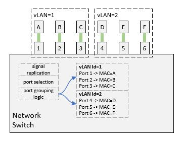
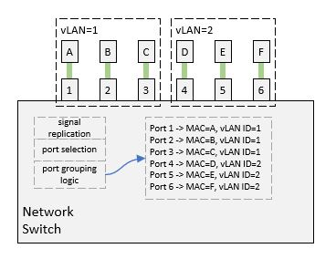

# vLANs

In the [The Network Switch](../04-the-network-switch/the-network-switch.md)
article, we saw that the network switch passes the data from one connected
machine to another. The closure of such machines is called a 'Local Area 
Network' or LAN for short.

If we wanted to segment the connected machines into different groups, where
a machine from one group cannot communicate with one in another group, then
each group can be thought of as a separate LAN. If the separation is not
done using different physical switches, but rather using a single physical
switch that has logical support for the separation, then, we call each group a
virtual-LAN - or vLAN for short.

Since all traffic goes through the network switch, the network switch can
implement a check to separate the traffic of one group of machines from the
other.

The user will need to configure the network switch to have two vLANs. The
configuration will include a vLAN Id for referencing, and a way to designate
which machine falls into which vLAN. This can be either hard-coded or through
pattern matching.

Internally, the switch can implement the various groups through a variety of
ways. For example, it can maintain a port-to-identity table for each vLAN
(figure A) - or it can add a new column; vLAN id, in the port-to-identity table
(figure B).

[Figure A](./vlans-a.jpg)

[Figure B](./vlans-b.jpg)

There are many ways of grouping machine identities, one way is to designate
which ports on the network switch belong to which group. For example, we can
say that ports 1-12 belong to vLAN 1 while ports 13-24 belong to vLAN 2. When
each machine connects, it will encode its identity in packets originating from
it (as we have seen before) and the network switch can build its
port-to-identity tables and assign each entry with a vLAN.

What if we want to control that group association through software, not through
physical ports?

A possible way is to be able to describe the identities collectively. For
example, if we can describe a group of machines as those with MAC addresses
starting with a certain prefix, then the network switch can associate a machine
to the right vLAN once it sends any communications through the switch.

In reality, however, using MAC addresses for such purpose is not doable because
they are randomly generated, and it is almost impossible to find a consistent
pattern among a number of network cards connected to a LAN.

This is where software assigned identities come into the picture! Those
identities can be shaped with much more flexibility for easier referencing in
the network configuration.

Worth nothing here, that when the switch uses the MAC address for figuring out
how to redirect data to its destination, it is called a Layer 2 routing.

We will talk about what software assigned identities are and how to use them
in our next article.

----

[Main Page](../README.md) | [Previous: The Network Switch](../04-the-network-switch/the-network-switch.md) | [Next: IP Addresses](../06-ip-addresses/ip-addresses.md)