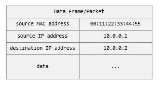

# IP Addresses

In the previous articles, we have talked about how computers need an identity
on the network so traffic can be directed to them.

One identity we talked about is the hardware identity of the network card -
a.k.a. the MAC address.

When there is a group of computers to manage, it is easier to manage many
networking aspects if we can assign identities that are easy to understand, 
query, and group.

The IP (Internet Protocol) addressing scheme is one such mechanism. It
satisfies these requirements by simply being a range of numbers that are
specified by the user. The IP scheme has two versions in use today; IPv4 and
IPv6.

In the case of IPv4, the range is specified by 4 bytes. The convention for
writing it is four decimal numbers separated by dots - where each number
represents a byte. For example: `255.255.0.255`.

For the case of IPv6, the range is specified by 16 bytes. The convention for
writing it is 8 hexadecimal numbers separate by colons - where each number
represents 2 bytes. For example `2001:0DB8:AC10:FE01:0000:0000:0000:0001`.

Because these identities are just numbers, you can easily carve ranges - for
example, you can say I will be using the range from 0 to 99 for vLAN 1 and 100
to 199 for vLAN2. The numbers are easy to write and remember, and so are the
ranges!

The networking engineers have taken a step further when defining the ranges,
and instead of using a 'from x to y' notation, they represent it with how many
bits are reserved for the fixed part of the bit string.

For example, in IPv4 there are 4 bytes which contain 4x8=32 bits. If I want
to define the range 0-3, that means the 2 least significant bits will be
changed to accommodate that range, and the rest (the other 30 bits) will stay
fixed. So, the notation for that range would be `0.0.0.0/30`.

Note that the range does not have to start from 0, for example, you can define:
`10.0.0.0/30` - and that will mean the addresses:
- `10.0.0.0`
- `10.0.0.1`
- `10.0.0.2`
- `10.0.0.3`

Another way of expressing the range is the "Subnet Mask" - where we create a
mask of the same size as the IP adddressing scheme, and then we set the bits
to be fixed to 1s. For example, `255.255.240.0` transaltes to `11111111.11111111.11110000.00000000`,
which means the first 20 bits will be fixed, and last 12 bits can change.

Note that this notation does not say what the fixed part is - it just says which
bits are fixed. For example: if the subnet mask is `255.255.240.0`, and we know
that IP `172.21.224.1` belongs to that range, then:

```
Subnet Mask: 255.255.240.0  11111111.11111111.11110000.00000000
                            |------- fixed ------||--variable-|
IP         : 172.21.224.1   10101100.00010101.11100000.00000001
Range Start:                10101100.00010101.11100000.00000000 -> 172.21.224.0
Range End  :                10101100.00010101.11101111.11111111 -> 172.21.239.255
```

If we were to write this in the IP mask notation, we would write: `172.21.224.0/20`.

Note that IP assignment will be part of the data travelling the network. For
example, if Machine A with IP 10.0.0.1 sends data, that IP address will be
encoded in the network packet as its source. If it is sending it to Machine B
whose IP is 10.0.0.2, then, likewise, that IP address wil be encoded in the
network packet as its destination.

When the network switch receives the data packet, it will inspect its source
and destination and direct it accordingly.



[Figure A](./ip-addresses-a.jpg)

Since the software identity assignment is on top of the physical layer (
physical network cards, physical network card identity), it is considered a
layer higher - Layer 3.

Some switches operate at Layer 2 (physical identity; or MAC addresses) and some
operate at Layer 2 (software identity; or IP addresses).

So how do the IP addresses get generated and assigned to machine?

Let's explore that in the next article!

## Command Reference

On Windows, you can find the IPv4 address of the network card on your computer
by running the below command and looking for the `IPv4 Address` in the output:

```bash
ipconfig /all
...
Ethernet adapter vEthernet (Private):
...
 IPv4 Address. . . . . . . . . . . : 172.21.224.1(Preferred)
 Subnet Mask . . . . . . . . . . . : 255.255.240.0
...
```

On Azure Linux, you can achieve the same by running the below command and
looking for the `inet` lines in the output:

```bash
ip a
...
link/ether 00:11:22:33:44:55
inet 10.137.193.71/23
...
```

----

[Main Page](../README.md) | [Previous: vLANs](../05-vlans/vlans.md) | [Next: IP Address Assignment](../07-ip-address-assignment/ip-address-assignment.md)