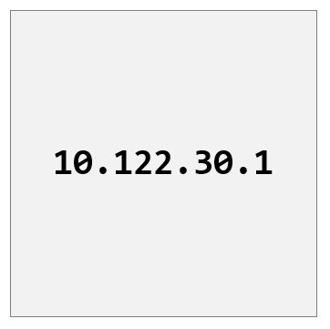
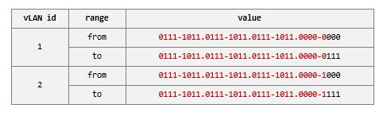
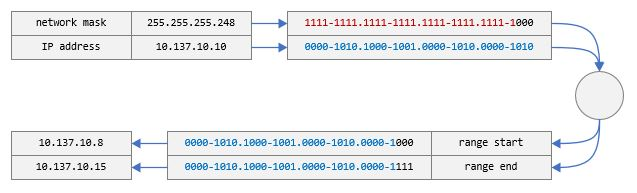
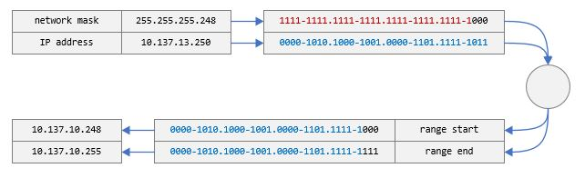

# IP Addresses



## Overview

In the previous articles, we have talked about how computers need an identity
on the network so traffic can be routed to them.

One identity we talked about is the hardware identity of the network card -
a.k.a. the MAC address.

When we have a group of computers to manage, it is far more efficient and
robust to manage many of its networking aspects if we have a mechanism to
assign network identities that are easy to understand, query, and group.

The IP (Internet Protocol) addressing scheme is one such mechanism. It
satisfies these requirements by simply providing a range of numbers - each of
which can be assigned to a network interface of a given machine. An assigned
number becomes the identity of the associated network interface and is called
its `IP address`. Other network computers/devices can refer to such network
interface using that `IP address`.

## Format and Ranges

The IP addressing scheme has two versions in use today: IPv4 and IPv6.

In the case of IPv4, the range of available IP addresses is specified by 4
bytes. The convention for writing an IPv4 address is to write four decimal
numbers separated by dots - where each decimal number corresponds to a byte.
Examples include `255.255.0.255`, `10.30.0.20`, `172.10.0.2`, etc. Given that
a byte can only have values between 0 and 255, each of the four IPv4 address
numbers can only range from 0 to 255.

For the case of IPv6, the range is specified by 16 bytes. The convention for
writing it is 8 hexadecimal numbers separated by colons - where each number
represents 2 bytes - for example: `2001:0DB8:AC10:FE01:0000:0000:0000:0001`.

Because these identities are just numbers, you can easily carve ranges - for
example, you can say I will be using:
- the range `from 123.123.123.0 to 123.123.123.7` for vLAN 1.
- the range `from 123.123.123.8 to 123.123.123.15` for vLAN 2.

The numbers are easy to write and remember, and so are the ranges!

Now, let's see what those ranges look like in binary:



[Figure A](vlan-ranges.jpg)

Notice that,
we can represent the two ranges we have just mentioned as follows (note the
`x`s):
- the range `0111-1011.0111-1011.0111-1011.0000-0xxx` for vLAN 1.
- the range `0111-1011.0111-1011.0111-1011.0000-1xxx` for vLAN 2.

Now, consider an address like `123.123.123.124` - which range does this address
belong to? First, its binary form is `0111-1011.0111-1011.0111-1011.0111-1100`.
And looking up the ranges in the table, it belongs to vLAN 2.

To easily encode the range an IP address belongs to, the networking engineers
have devised the IP mask notation - where basically the range is represented
by the number of bits that are fixed (from the left) in a given IP address.

For example, the number of bits that is fixed for the ranges above is **29**.
So, we can write `123.123.123.124/29`. By looking at such notation, we can
deduce what range the address `123.123.123.124` belongs to.

Another way of expressing the range an address belongs to is to turn the number
of fixed bits (from above) into a 'mask' - where a digit set to 1 means it does
not change and a digit set to 0 means it can change. Such a mask is called the
"network mask". And because the network mask bit count has to match the count
of bits in an IP address, it looks very similar to an IP address, but it does
not denote the same thing.

In our example, above, the IP mask `/29` would be translated to network mask:
`1111-1111.1111-1111.1111-1111.1111-1000` or `255.255.255.248`.

Note that the network mask by itself cannot tell us the range, however, it
can tell us the size of the range. For example, converting `248` to binary
yields `1111-1000` - so, we know the size of the range is 8 addresses (3 0s
indicate 3 bits can change, which results in 8 combinations).

When the network mask is combined with an IP address, only then it can be used
to deduce the exact range. For example:



[Figure A](ip-addresses-network-masks-ex0.jpg)

Another example:



[Figure B](ip-addresses-network-masks-ex1.jpg)

## Layer 3 Network Switches

Given that a network packet carries the identities of its source and
destination, then, the IP address of the source network interface and the IP
address of the destination network interface will both be encoded in the packet.

In the previous article, the network switch kept a mapping of each MAC address
and port - so that it can route incoming packets efficiently. Such network
switch is called a Layer 2 Network Switch (because it operates on the MAC
addresses).

In order to take advantage of the IP address, the network switch needs to be
aware of it so that it can extract it from incoming packets and use it to build
the address to port mapping as with the MAC addresses (and then route the
packets). Such network switch is called a Layer 3 Network Switch (because it
operates on the IP addresses).


[Figure C](./ip-addresses-a.jpg)

## Try It Out

On Windows, you can find the IPv4 address and network mask of the network
interface on your computer by running the command below and looking for the
`IPv4 Address` in the output:

```bash
ipconfig /all
...
Ethernet adapter vEthernet (Private):
...
 IPv4 Address. . . . . . . . . . . : 172.21.224.1(Preferred)
 Subnet Mask . . . . . . . . . . . : 255.255.240.0
...
```

On Azure Linux, you can find the IPv4 address and IP mask of the network
interface on your computer by running the command below and looking for the
`inet` lines in the output:

```bash
ip a
...
link/ether 00:11:22:33:44:55
inet 10.137.193.71/23
...
```

## Next Steps

So how do the IP addresses get generated and assigned to each network interface?

We will explore that in the next article!

----

[Main Page](../README.md) | [Previous: vLANs](../05-vlans/vlans.md) | [Next: IP Address Assignment](../07-ip-address-assignment/ip-address-assignment.md)