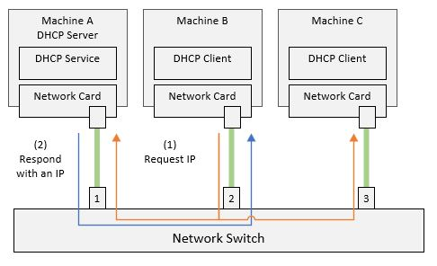

# IP Address Assignment

## Overview

In the same way one can assign a name to a machine when it is being setup, one
can also assign an IP address to the machine in the same fashion. Because the
IP is assigned manually, it is called a static IP. This is in contrast to a
dynamic IP that is assigned automatically by another computer on the network.

## Static IPs

Static IPs are useful in cases where there is no infrastructure to assign IPs
automatically. They are also useful when the operator (the person setting up
the machine) wants predictable/pre-known IPs to use with other software
solutions.

When configuring a computer with a static IP, we need to first know which
network it will be part of, and what the subnet mask for that network is.
This will help us assign the computer an IP that is reachable by other
computers on that network. Should we assign an IP outside the allowed range,
other computers will not be able to reach it - the switch will think it does
not belong to the same network.

Each operating system has its own way of defining static IPs. Let's see
how Azure Linux allows its user to configure static IPs.

### Static IP Assignment on Azure Linux

On Azure Linux, there are multiple ways of assigning a static IP to a network
adapter (also called network interface).

First, we need to know the name of the network interface we are targeting.
We can achieve that by listing the detected interfaces using `ip a`:

```bash
ip a
1: lo:
   ...
2: eth0:
   ...
```

In this example, we have two network interfaces `lo` and `eth0`.

Then, one way to assign an IP is to use `ifconfig` with the interface name.
For example:

```bash
ifconfig eth0 10.185.135.4 netmask 255.255.255.128 up
# where:
#   eth0
#                is the interface name.
#   10.185.135.4
#                is the IP address to assign.
#   netmask 255.255.255.128
#                is the subnet mask.
#   up
#                is a flag to bring the interface up and enable it.
```

Another way is to use `ip address add`. For example:

```bash
ip address add 10.185.135.4/25 dev eth0
# where:
#   dev eth0
#                is the interface name.
#   10.185.135.4
#                is the IP address to assign.
#   /25
#                is the subnet mask.
```

Finally, you can also assign IPs by creating a configuration file for the
target interface. For example:

```bash
# Create a configuration file
cat <<EOF >> /etc/systemd/network/10-static-eth0.network
[Match]
Name=eth0
[Network]
DHCP=no
Address=10.185.135.4/25
...
EOF

# Ensure it has the necessary permissions for the network stack to read it.
chmod 644 /etc/systemd/network/10-static-eth0.network

# Restart the network stack
systemctl restart systemd-networkd
```

Note that the `DHCP=no` is important to ensure that the network stack does not
try to assign an IP dynamically to this network interface.

## Dynamic IPs

Dynamic IPs are IPs that get assigned automatically by another computer on the
network. This computer is called a DHCP server. The DHCP server is first
configured with the range of IPs that is available, and when a new computer
wants to join the network, it broadcasts a request for an IP. The request will
get to all other computers on the network including the DHCP server. The DHCP
server will then allocate an unused IP from the specified range, and send it
back to the computer that sent the IP request. The new computer will then
configure the network adapter with that IP.

The DHCP server is running, well, the DHCP service stack - that's a service
that maintains a database of available IPs and keeps track of which ones
are available and which have been assigned. It also keeps track of how long
each IPs has been assigned and can have a time limit before recycling the used
IPs.

The DHCP client is running on every machine that is configured to request a
dynamic IP. While the DHCP client is one instance per machine, it applies only
to network cards that are configured to get dynamic IPs - in other words, you
can have a machine with multiple network cards - some are statically configured
with IPs and some are dynamically configered.



[Figure A](./dynamic-ip.jpg)

### Dynamic IP Configuration on Azure Linux

To configure a specific network card to use dynamic IPs on Azure Linux, you can
run the following commands:

```bash
# Create a configuration file
cat <<EOF >> /etc/systemd/network/10-static-eth0.network
[Match]
Name=eth0
[Network]
DHCP=yes
...
EOF

# Ensure it has the necessary permissions for the network stack to read it.
chmod 644 /etc/systemd/network/10-static-eth0.network

# Restart the network stack
systemctl restart systemd-networkd
```

Note how we are configuring the `DHCP` property to `yes` instead of `no` as
we did in the static IP configuration above.

----

[Main Page](../README.md) | [Previous: vLANs](../06-ip-addresses/ip-addresses.md) | [Next: ]()