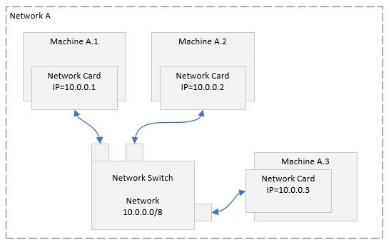
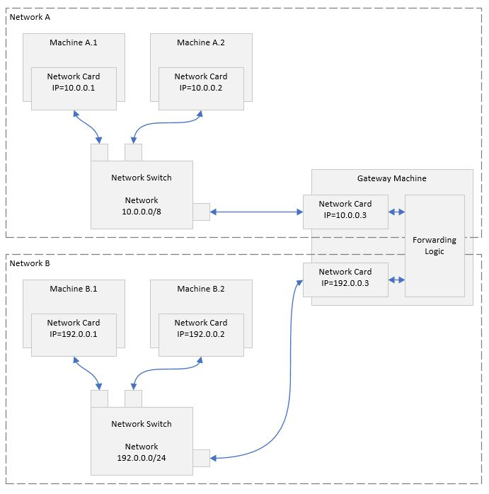
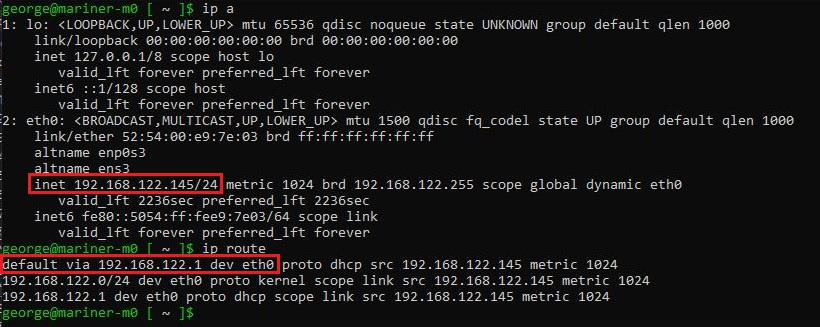
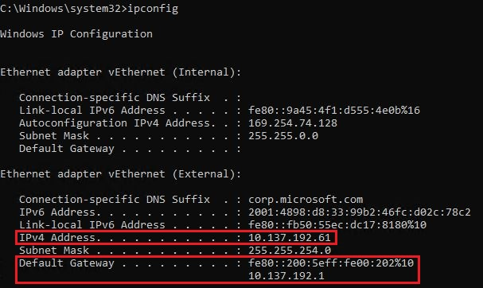
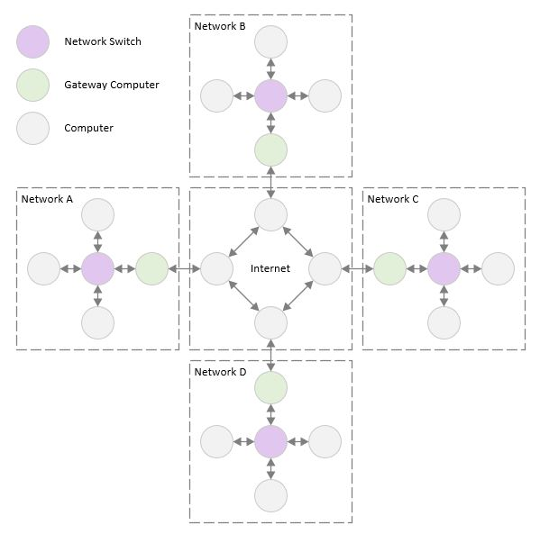
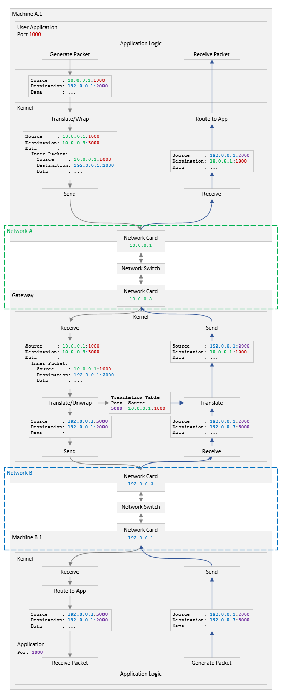

# Connecting Two Networks

## Overview

Connecting two networks is a very vast and deep topic. When approaching such
topics for the first time, I find it most helpful for me if I can find a
high-level description of the problem and its possible solutions - like a
conceptual overview. This helps me connect the big blocks first before I delve
into details where it is harder to see the big picture and what we are trying
to accomplish. This article is my attempt to present a conceptual overview of
how two networks can be connected. My hope is that it serves as a good
introduction to this topic.

## The Gateway

In the previous articles, we talked about how a network can be assigned an IP
address sub-range and how the sub-range indicates which addresses are in the
same network and which are not. For example, in the diagram below, `Network A`
has the sub-range `10.0.0.0/8`. `Machine A.1` can send data to `Machine A.2`
using its IP address `10.0.0.2`. However, if `Machine A.1` were to send data
to a machine with IP `192.0.0.2`, the packet would get dropped since there is
no such address on this network.



[Figure A](./network-a.jpg)

In practice, it is rare for a network to exist in isolation. Typically,
machines in one network need to communicate with machines in another network.

Each network has its own configuration; physical configuration (machines,
switches, etc) and logical configuration (network mask, etc).

Such two networks cannot be connected directly - i.e. connect the switch from
`Network A` to the switch from `Network B` (for example). This is not possible
because the configurations of the two networks will conflict. For example, the
`Network A` switch is programmed with `10.0.0.0/8` while `Network B` requires
the switch to process traffic for `192.0.0.0/24` - so which range do we
configure the switch with?

One way of solving this problem is to have a `gateway` machine connecting both
networks. The `gateway` machine has two network cards - one for each network.
Then, the `gateway` machine sees traffic from both networks, and can transfer
traffic from one network to another as needed.

To illustrate how this is done, let's say we have two networks:
- Network A (10.0.0.0/8).
- Network B (192.0.0.0/24).

When traffic originates from a machine in `Network A` and is destined to a
machine in `Network B`, the traffic is sent to the `gateway` machine on
`Network A`. The `gateway` machine then reads the data, realizes that it is
meant for `Network B`, and accordingly forwards it to `Network B` through the
network card that is connected to `Network B`.



[Figure B](./networks-a-b.jpg)

For this to work, the machines sending data need to have prior knowledge of
which machine on their network is the `gateway` machine. This knowledge can be
configured manually by the network administrator, or the machine can
dynamically acquire that information from the `DHCP` server when it gets its
own IP address.

On a Linux system, one can determine the IP of the current gateway machine of
a computer's network by running `ip route` on that computer:



[Figure C](./ip-route.jpg)

In Figure C, you can see that the machine IP address is `192.168.122.145` and
its gateway IP address is `192.168.122.1` on device (i.e. on network card)
`eth0`.

On a Windows system, you can retrieve the same information by running `ipconfig`
from a command prompt:



[Figure D](./ipconfig.jpg)

In Figure D, also, you can see the machine IP address is `10.137.192.61` and
its gateway IP address is `10.137.192.1` on device `Ethernet adapter vEthernet
(External)`.

## Address Translation

So far, we have seen that the `gateway` machine is responsible for connecting
two networks by routing data from one network to the other. But how is this
exactly done?

Let's follow a packet while it travels from one network to another. The packet
will travel from machine `A.1` with IP address `10.0.0.1` in `Network A` to
machine `B.1` with IP address `192.0.0.1` in `Network B`. The packet header
looks like this:

```
Source     : 10.0.0.1:1000
Destination: 192.0.0.0.1:2000
Data       : ...
```

Note that the IP address is followed by the `port` number. The port number is
used by the kernel on the destination machine to route the packet to an
application running on that machine. Applications can register with the kernel
so that they receive all traffic destined for a specific port.

When the kernel on machine `A.1` receives the packet (from the sender
application), it inspects the destination address and realizes that the
destination is not on the same network. The kernel then proceeds to check if
there is a gateway machine configured and finds out that 10.0.0.3 is configured
to be the gateway. The kernel now needs to send the packet to the gateway -
while still preserving the destination address. This can be done by wrapping
the packet with something like:

```
Source     : 10.0.0.1:1000
Destination: 10.0.0.3:3000 [gateway]
Data       :
  Inner Packet:
    Source     : 10.0.0.1:1000
    Destination: 192.0.0.0.1:2000 [final destination]
    Data       : ...
```

When the gateway receives the packet, it needs to decide whether it is meant for
the gateway itself, or it is meant for another network and the gateway needs
to forward it.

This distinction can be made via the gateway port targeted by the incoming
packet. In this case, let's say, port 3000 on the gateway means that the
packet should be unwrapped and then forwarded to another network.

So, the gateway kernel forwards the message to port 3000 where the forwarding
application picks it up, unwrapps it, and sends it over the other network
adapter to `Network B` (for efficiency reasons, the forwarding application is
most likely another part of the kernel).

On `Network B`, the packet reaches the network switch, and from there gets sent
to `B.1` with IP address `192.0.0.1`.

The packet has arrived safely! Mission accomplished!

## The Return Trip

Now, let's say machine `B.1` wants to send a response to the machine which has
sent the message. It inspects the incoming packet, and sees that the source is
set to `10.0.0.1:1000`. This address does not belong to the current network (i.e
`Network B`).

One can say that we can configure our `Network A` `gateway` machine to be also
the `Network B` `gateway` machine. And indeed this can be done and is a viable
solution.

The problem with this solution is that `Network B` needs to know about
`Network A`. And while for a two-network setup this might not be a huge amount
of work - it will not scale up to a larger number of networks. For example,
consider the internet: millions of private networks get connected to the
internet. There is no efficient way to keep the internet aware of all the
private networks that get connected to it. Not to mention that the IP ranges of
those private networks will start conflicting very quickly as users keep adding
them.



[Figure E](./internet-gateways.jpg)


A solution for this problem is to have the gateway abstract all machines in the
private network behind it and present all traffic to the other network as if
it were originating from the gateway itself. That way, only the gateway IP
address on the other network needs to be unique. And all machines on the other
network will receive gateway traffic thinking it originated from it. This also
means that all responses will be directed to the gateway machine.

How can the gateway impersonate all machines in the private network behind it?
Well, similar to the wrapping we mentioned above, we can also translate the
source information. For example:

For packet:
```
Source     : 10.0.0.1:1000
Destination: 10.0.0.3:3000 [network A gateway]
Data       :
  Inner Packet:
    Source     : 10.0.0.1:1000
    Destination: 192.0.0.0.1:2000 [final destination]
    Data       : ...
```

The gateway kernel will extract the inner packet and:

- translate it to (note the port `5000`):
  ```
  Source     : 192.0.0.3:5000 [network B gateway]
  Destination: 192.0.0.0.1:2000
  ```
- build a table with the following mapping:
  ```
  port    private network ip address and port
  5000    10.0.0.1:1000
  ```

The mapping will be used when a response comes to the gateway from `Network B`.

Then, the gateway sends the packet with the new header to `Network B`, and when
a response packet is received by the gateway on port `5000`, the gateway kernel
will use the mapping table to translate the destination address back to
`10.0.0.1:1000`. Then, the gateway will forward the translated response packet
on `Network A`.

This address translation is called `Network Address Translation` or `NAT'ing`
for short.

## The Round Trip

Here is a simplified diagram of a packet travelling to its destination on a
different network and its response travelling back as well:



[Figure F](./round-trip.jpg)
