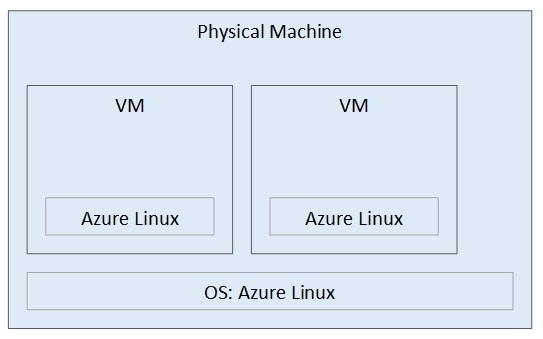
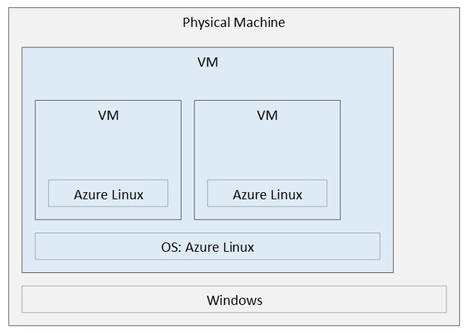

# Setup

## Overview

To experiment with the networking stack, we need to have more than one machine.
The easiest way is to create virtual machines and set them up in a such a way
that simulates physical networks.

We will need a powerful physical machine running Linux or Windows. This machine
will be the host for all our virtual machine. The specs of that machine should
be like the following or higher:
- CPU: 8 cores i5.
- RAM: 12 GB.
- Disk: 40 GB of empty disk space. It is best if the disk is an SSD.

[Figure A](./machine-setup-a.jpg)

Since we will be focused on Azure Linux, if you have a Windows machine and
would like to keep it running Windows, you can create an Azure Linux on the
Windows machine and then do all the work on the Azure Linux machine as if it
were a physical machine.

[Figure B](./machine-setup-b.jpg)

## Setting up The Azure Linux Physical Machine

To setup the physical machine:
- Download the latest Azure Linux iso from the [CBL-Mariner github page](https://github.com/microsoft/CBL-Mariner).
- Make a bootable USB drive using something like [Rufus](https://rufus.ie/en/).
- Boot-up the physical machine and ensure that booting from USB is enabled in
  the BIOS/UEFI configuration.
- Insert the USB drive and boot the machine.
- Follow the setup wizard prompts.
  - For the host name, type `physicalhost`. We will be using that name later.
    You can choose a different name and replace our references to
    `physicalhost` with the name you have chosen.

## Setting up The Windows Physical Machine

To setup the physical machine:
- Determine which edition of Windows you have where hyper-v is included.
- Download an iso of that edition.
- Make a bootable USB drive using something like [Rufus](https://rufus.ie/en/).
- Boot-up the physical machine and ensure that booting from USB is enabled in
  the BIOS/UEFI configuration.
- Insert the USB drive and boot the machine.
- Follow the setup wizard prompts.

Once Windows setup is complete, we need to create a virtual machine running
Azure Linux.

To create a virtual machine:
- In the Windows search box, type hyper-v, and select 'Hyper-V Manager'.
- Create a new 'Virtual Switch':
  - Click on the 'Virtual Switch Manager...' from the right pane titled
    'Actions'.
  - Click 'New virtual network switch' and select 'External' as its type.
  - Click 'Create Virtual Switch`.
    - Give it a name, we will call it 'External' in our references.
    - Make sure that under 'External network' you have the network card that is
      connected to the internet selected.
    - You can leave all the other settings with their defaults.
    - Click 'OK'.

