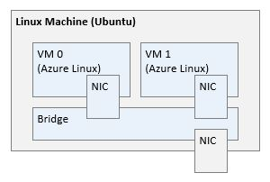
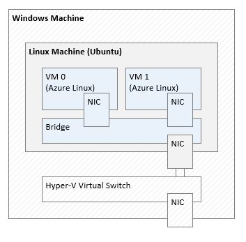

# Basic Setup

## Overview

In order to experiment with computer networking, we need to create a few
networks, add a few machines to each network, and connect them to each other
and to the internet.

This is not feasible for the majority of us due to the cost of having such a
setup. However, this can be simulated using virtualization. We can create
virtual switches and virtual machines (with virtual network cards) and create
most of the network setups we want!

This also means that we need to learn a little bit about virtualization and how
to create and manage all those entities.

In the sections below, we will explore how to setup our testing environment. We
will cover setting up the environment on both Linux and Windows.

## Linux Setup

For this setup, the host machine will be running Ubuntu and the guest virtual
machines will be running Azure Linux.

[Figure A](./baremetal-ubuntu.jpg)

Here are detailed walk-throughs on how create this setup:
- [Install The Ubuntu Host](./install-ubuntu-host/install-ubuntu-host.md)
- [Create Azure Linux Virtual Machines](./create-azure-linux-vm/create-linux-vms.md)

## Windows Setup

For this setup, the host machine will be running Windows and it will host the
same Linux Setup as discussed above.

[Figure B](./baremetal-windows.jpg)

Here are detailed walk-throughs on how create this setup:
- [Configure The Windows Host](./configure-windows-host/configure-windows-host.md)
- [Create The Ubuntu Virtual Machine](./create-ubuntu-vm/create-ubuntu-vm.md)
- [Install The Ubuntu Host](./install-ubuntu-host/install-ubuntu-host.md)
- [Create Azure Linux Virtual Machines](./create-azure-linux-vm/create-linux-vms.md)
