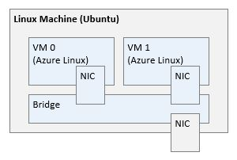
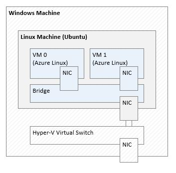

# Basic Setup

## Overview

In order to experiment with computer networking, at a minimum, we need to
create multiple networks each with multiple machines, and connect the networks
to each other and to the internet.

This is not feasible for the majority of us due to the cost of having such a
setup. However, this can be simulated using virtualization. We can create
virtual switches and virtual machines with virtual network cards and create
most of the networks we want!

This also means that we need to learn a little bit about virtualization and how
to create and manage all those entities.

In the sections below, we explore how to setup our testing environment whether
your computer is running Linux or Windows.

## Linux Setup

For this setup, we will have the host machine running Linux (Ubuntu) and the
guest virtual machines running Azure Linux.

[Figure A](./baremetal-ubuntu.jpg)

Here are detailed walk-throughs on how do this setup:
- [Create The Linux Host](./create-ubuntu-vm/create-linux-host.md)
- [Create Azure Linux Virtual Machines](./create-azure-linux-vm/create-linux-vms.md)

## Windows Setup

If you have a machine with Windows Professioinal, Windows Enterprise, or
Windows Data Center, then you can create the same Linux setup discussed earlier
as a virtual machine running on the Windows host.

[Figure B](./baremetal-windows.jpg)

Here are detailed walk-throughs on how do this setup:
- [Create The Windows Host](./create-windows-host/create-windows-host.md)
- [Create The Linux Host](./create-ubuntu-vm/create-linux-host.md)
- [Create Azure Linux Virtual Machines](./create-azure-linux-vm/create-linux-vms.md)
