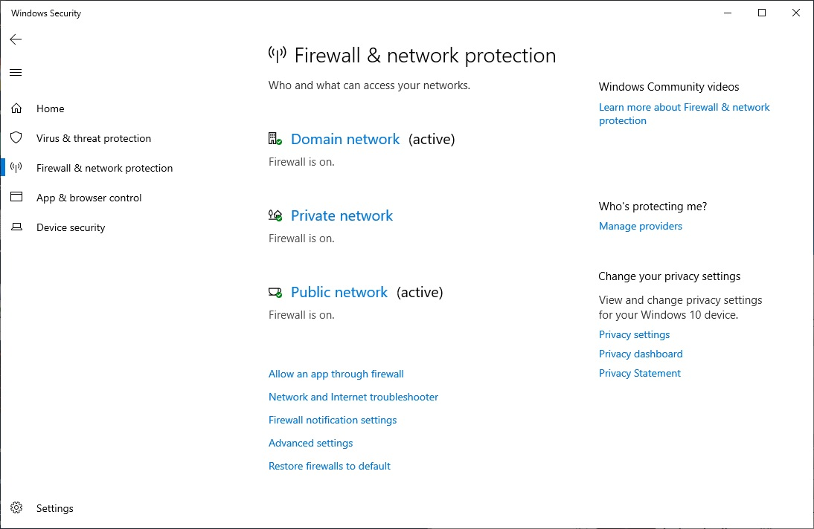
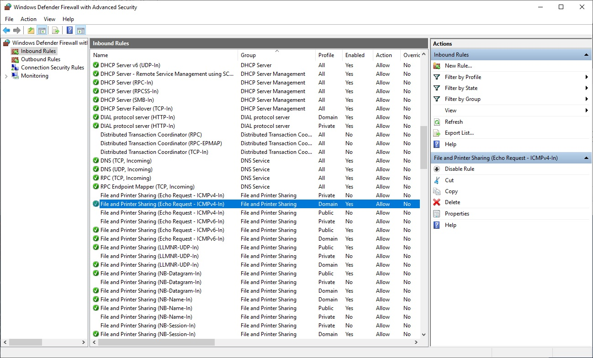

# Configure Windows Host

#### Make a Windows machine ping-able

1. Open `Windows Defender Firewall with Advanced Security`
   - In the start menu, type `Windows Security`.
   - Click `Firewall & network protection`.
   - Click `Advanced settings`.

[Figure A](./configure-windows-firewall.jpg)

2. Enable ping from machines within the domain:
   - Click `Inbound Rules`
   - Right click `File and Printer Sharing (Echo Request - ICMPv4-In)` entry that
     has the `Profile` set to `Domain`.
   - Select `Enable Rule`.

[Figure B](./configure-windows-ping.jpg)

----

[Basic Setup](../basic-setup.md)