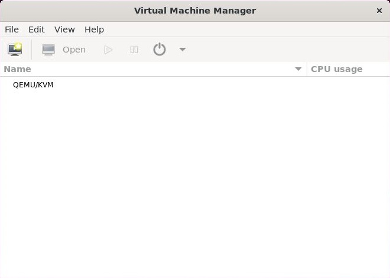
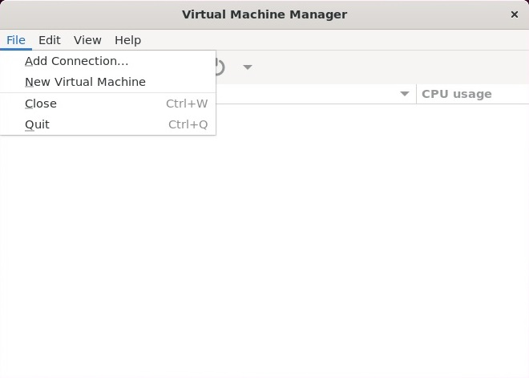
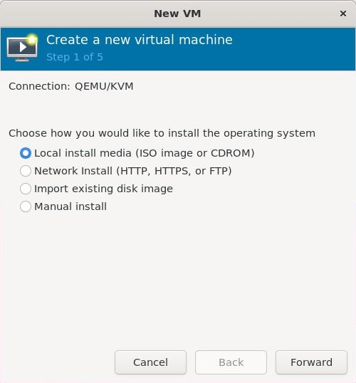
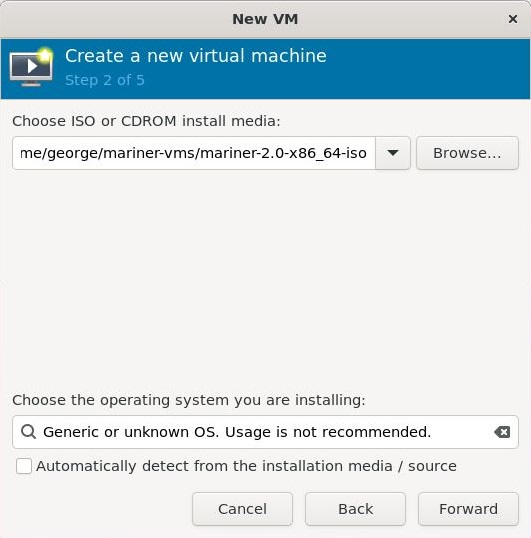
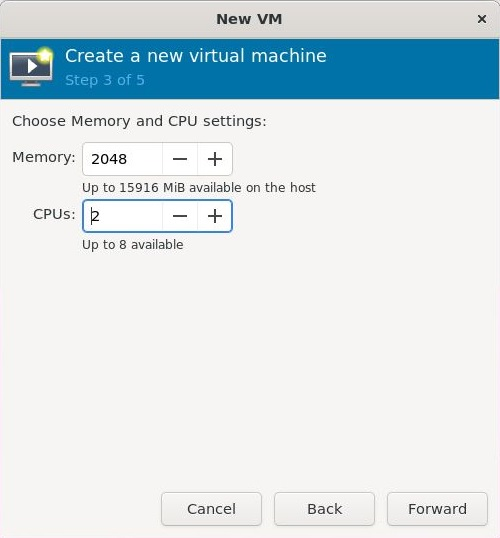
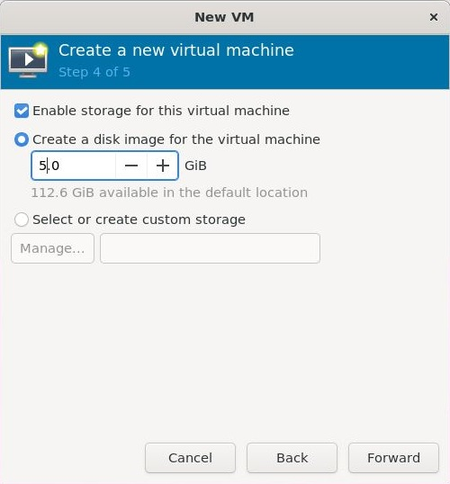
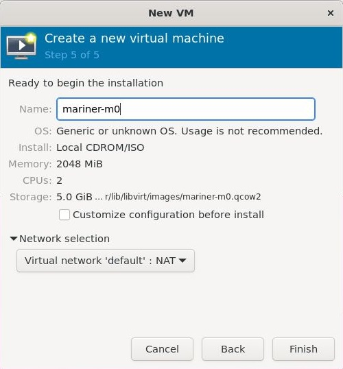

# Create Linux VMs

In this walk-through, we will create three virtual machines running Azure Linux
within our [Linux Host](../create-ubuntu-host/create-ubuntu-host.md).

1. Open a Terminal and download the latest Azure Linux ISO using:
```bash
wget https://aka.ms/mariner-2.0-x86_64-iso
```

2. Using the UX in Ubuntu, start `Virtual Machine Manager`:



[Figure A](./virtual-machine-manager-0.jpg)

3. Create a new virtual machine by selecting `File | New Virtual Machine`:



[Figure B](./virtual-machine-manager-1.jpg)

4. On the media source dialog:
   1. Select `Local install media (ISO image or CDROM)` 
   2. click `Forward`.



[Figure C](./virtual-machine-manager-2.jpg)

5. On the iso/os dialog:
   1. Browse to the ISO file you downloaded in step 1 above.
   2. Uncheck `Automatically detect from the installation media/source`.
   3. Under `Choose the operating system you are installing:`, select `Generic
      or unknown OS. Usage is not recommended` (because Azure Linux has not
      been added to `Virtual Machine Manager` yet).
   4. Click `Forward`.



[Figure D](./virtual-machine-manager-3.jpg)

6. On the memory/cpu dialog:
   1. Assign 2GB for memory.
   2. Assign 2 CPUs.
   3. click `Forward`.



[Figure F](./virtual-machine-manager-4.jpg)

7. On the storage dialog:
   1. Assign 5GB for disk space.
   2. click `Forward`.



[Figure G](./virtual-machine-manager-5.jpg)

8. On the networking dialog:
   1. Assign the name `mariner-m0` to the machine.
   2. Under `Network selection`, select `Virtual network 'default': NAT`.



[Figure H](./virtual-machine-manager-6.jpg)

9. Click `Finish`.

10. Follow the Azure Linux installation prompts and log-in.

11. Rename the hostname by editing `/etc/hostname` and replacing its contents
    with `mariner-m0`.

12. Repeat steps 3-11 for each additional virtual machine. The other two
    machines will be named `mariner-m1` and `mariner-m2`.

----

[Basic Setup](../basic-setup.md)