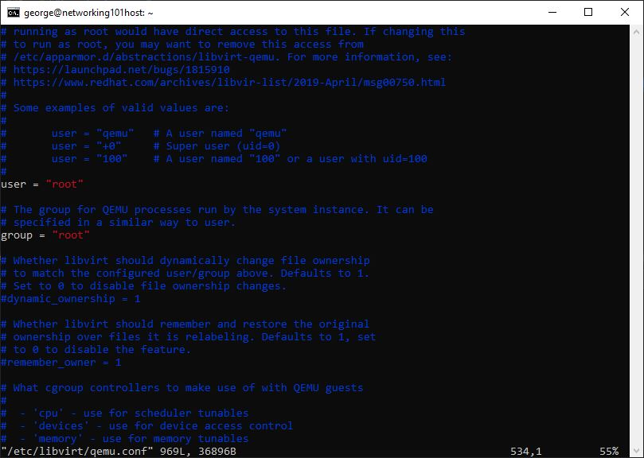
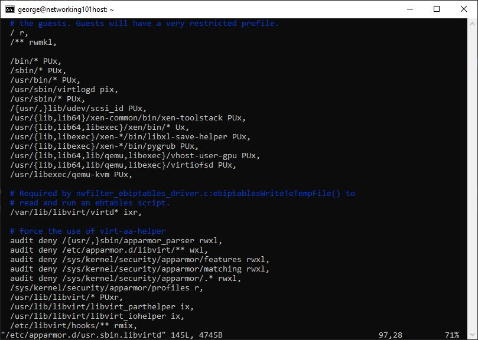

# Create Linux Host

- Download the latest Ubuntu Desktop LTS version from there download page here 
  [https://ubuntu.com/download/desktop](https://ubuntu.com/download/desktop).

#### Install Utilities

```bash
sudo apt update
sudo apt install net-tools
sudo apt-get --assume-yes install openssh-server vim tar wget curl gawk
sudo apt-get update
```

#### Install virtualization stack

```bash
sudo apt-get --assume-yes install qemu-utils qemu-kvm libvirt-daemon-system libvirt-clients bridge-utils
sudo adduser $USER libvirt
sudo adduser $USER kvm
sudo apt-get --assume-yes install virt-manager
```

#### Configure QEMU

```bash
sudo ln -s /usr/bin/qemu-system-x86_64 /usr/libexec/qemu-kvm

# uncomment user and group so that they are equal to root.
# search for #user and #group
sudo vim /etc/libvirt/qemu.conf
```



#### Configure AppArmore

```bash
sudo vim /etc/apparmor.d/usr.sbin.libvirtd
# under the '# Very lenient profile for...' add:
  /usr/libexec/qemu-kvm PUx,
```



#### Install xrdp

```bash
# Install xrdp client
sudo apt-get --assume-yes install xrdp
sudo adduser xrdp ssl-cert
sudo systemctl restart xrdp
```

#### Reboot

```bash
sudo reboot
```
