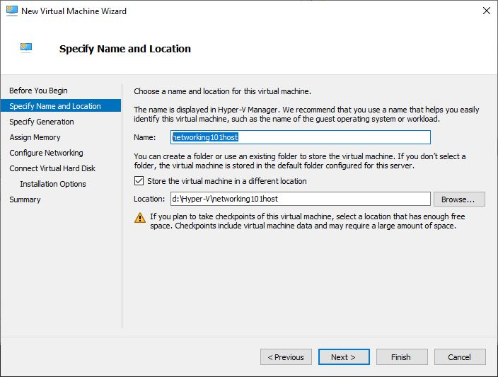
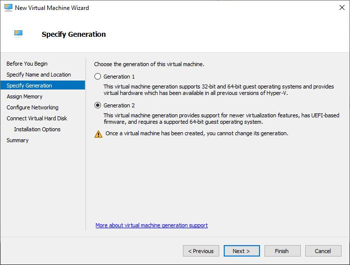
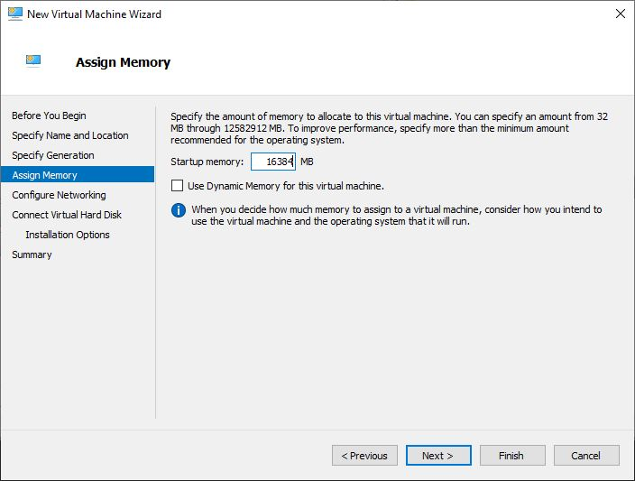
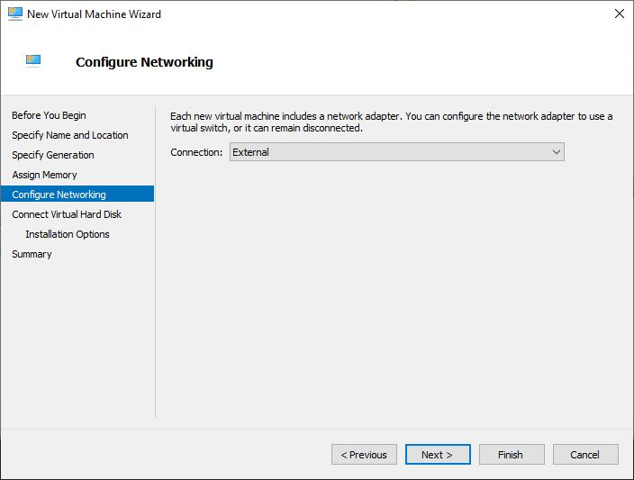
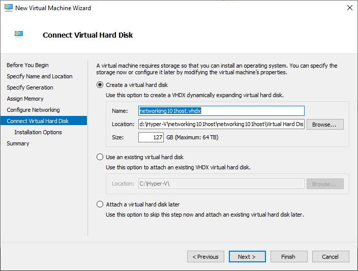
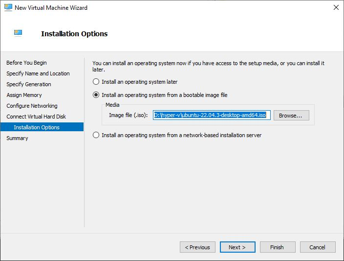
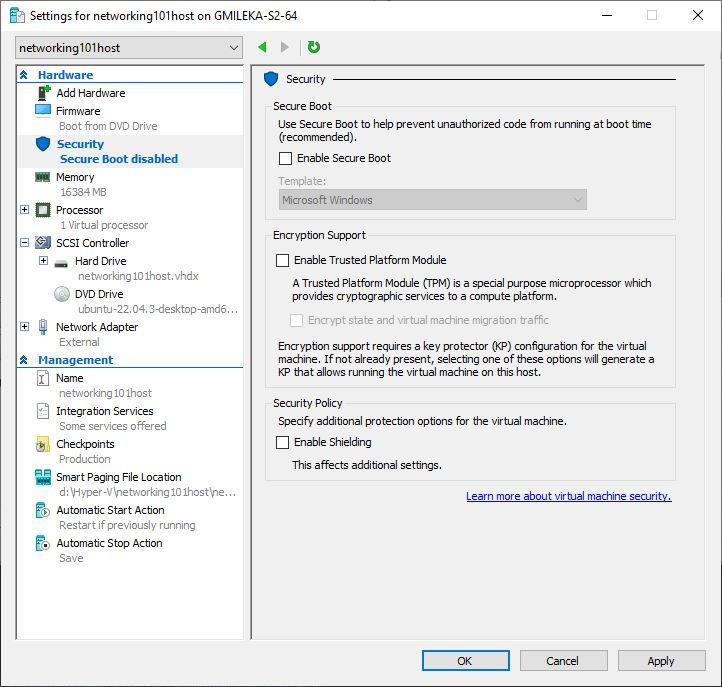
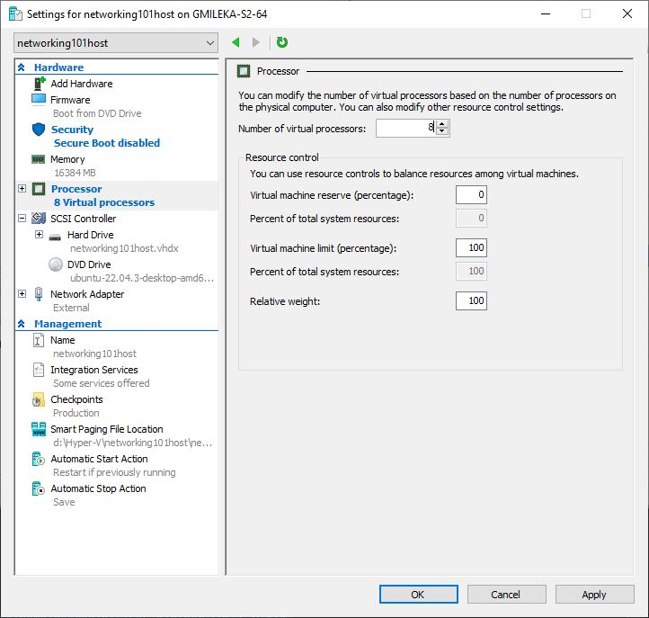
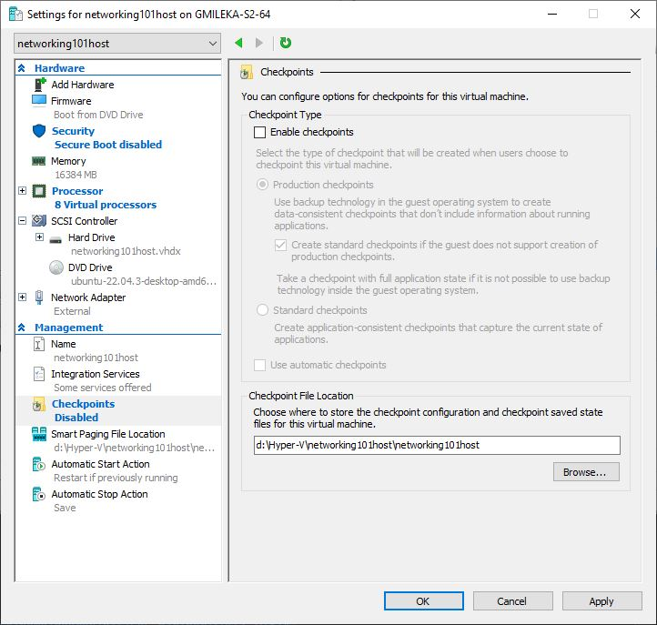
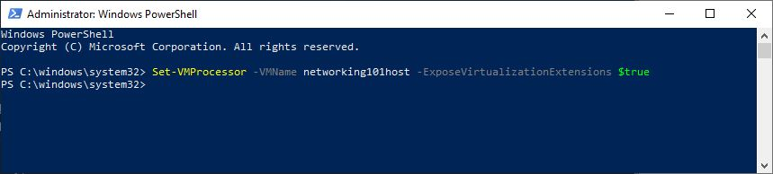

# Create Ubuntu VM

In this walk-through, we will create a Linux virtual machine running on
Windows Hyper-V.

Download the latest Ubuntu Desktop LTS ISO version from there download page
here: [https://ubuntu.com/download/desktop](https://ubuntu.com/download/desktop).

Start Hyper-V Manager

MISSING: Screenshot.

Create a virtual switch - External.

MISSING: Screenshot.

Create a new virtual machine.

MISSING: Screenshot.

Give it a name and a location on your host...

[Figure A](vm-create-specify-name-and-location.jpg)

Specify the generation...

[Figure B]( vm-create-specify-generation.jpg)

Since this virtual machine will be hosting a number of Azure Linux machines
, we should assign 16GB of memory or more.

[Figure C]( vm-create-assign-memory.jpg)

Since we want our networks to be connected to the internet, we will use the
`external` switch here.

[Figure D]( vm-create-configure-networking.jpg)

Same as above, since this virtual machine will hosting a number of Azure Linux
machines, we should assign a reasonable amount of disk space - the default
127GB is fine.

[Figure E]( vm-create-connect-virtual-hard-disk.jpg)

Set the installation media to the iso we have downloaded...

[Figure F]( vm-create-installation-options.jpg)

Disable secure boot...

[Figure G]( vm-configure-disable-secure-boot.jpg)

Increase the number of available processors to the virtual machine so its
performance is acceptable...

[Figure H]( vm-configure-set-processor-count.jpg)

Disable check points to avoid consuming too much space on the Windows host...

[Figure I](vm-configure-disable-check-points.jpg)

Finally, enable nested hardware virtualization so that our virtual machines
can expose the underlying virtualization hardware support to the nested virtual
machines...

[Figure J]( vm-configure-enable-nested-virtualization.jpg)

----

[Basic Setup](../basic-setup.md)