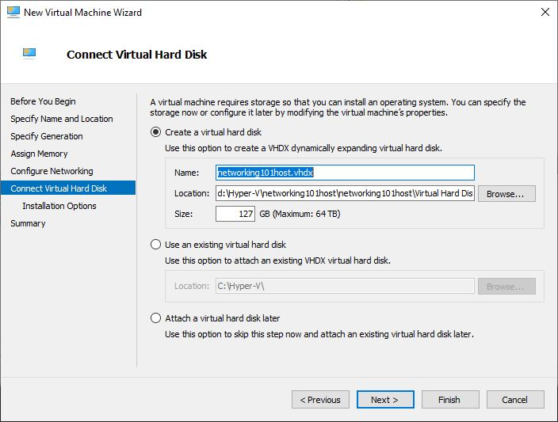

# Create Ubuntu VM

In this walk-through, we will create a Linux virtual machine running on
Windows Hyper-V.

Download the latest Ubuntu Desktop LTS ISO version from their download page
here: [https://ubuntu.com/download/desktop](https://ubuntu.com/download/desktop).

Start Hyper-V Manager by typing 'hyper-v' in the Start menu.

- Right-click the 'Hyper-V Manager' node on the left.
- Select 'Connect to Server'.
- Enter the name of the Windows host that you will use.


[Figure A](./hyper-v-initial.jpg)

#### Create a virtual switch:

- In the right pane, click 'Virtual Switch Manager...'.
- In the 'virtual Switches' pane (on the left), ensure 'New virtual network
  switch' is selected.
- In the 'Create virtual switch' pane (on the right), ensure 'External' is
  selected.
- Click the 'Create Virtual Switch' button.


[Figure B](./create-virtual-switch-0.jpg)

#### Configure the virtual switch:

- Under 'Name', enter 'External'.
- Under 'Connection type | External network', select the network card that
  you want to use with the virtual switch.
- Click 'Apply'.


[Figure C](./create-virtual-switch-1.jpg)

#### Create a new virtual machine.

In hyper-v, in the servers pane on the left, right-click the server where you
want to create the virtual machine, and select 'Create New Virtual Machine'.


[Figure D](./vm-create-0.jpg)

Click 'Next'


[Figure E](./vm-create-before-you-begin.jpg)

Give it a name and a location on your host...


[Figure F](vm-create-specify-name-and-location.jpg)

Specify the generation...


[Figure G]( vm-create-specify-generation.jpg)

Since this virtual machine will be hosting a number of Azure Linux machines
, we should assign 16GB of memory or more.


[Figure H]( vm-create-assign-memory.jpg)

Since we want our networks to be connected to the internet, we will use the
`external` switch here.


[Figure I]( vm-create-configure-networking.jpg)

Same as above, since this virtual machine will hosting a number of Azure Linux
machines, we should assign a reasonable amount of disk space - the default
127GB is fine.



[Figure J]( vm-create-connect-virtual-hard-disk.jpg)

Set the installation media to the iso we have downloaded...


[Figure K]( vm-create-installation-options.jpg)

Disable secure boot...


[Figure L]( vm-configure-disable-secure-boot.jpg)

Increase the number of available processors to the virtual machine so its
performance is acceptable...


[Figure M]( vm-configure-set-processor-count.jpg)

Disable check points to avoid consuming too much space on the Windows host...


[Figure N](vm-configure-disable-check-points.jpg)

Finally, enable nested hardware virtualization so that our virtual machine
can expose the underlying virtualization hardware support to the nested virtual
machines...
- Connect to the server where the virtual machine has been created.
- Open a PowerShell commnandline as an administrator.
- Run:
  ```PowerShell
  Set-VMProcessor -VMName networking101host -ExposeVirtualizationExtensions $true
  ```


[Figure O]( vm-configure-enable-nested-virtualization.jpg)

----

[Basic Setup](../basic-setup.md)