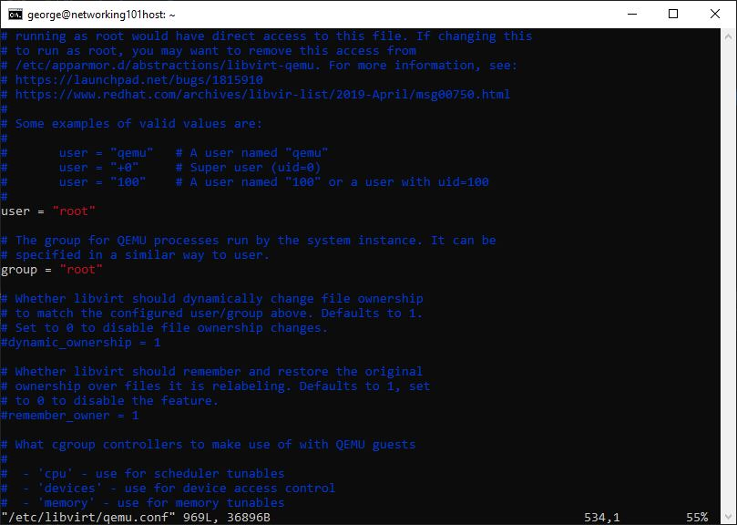
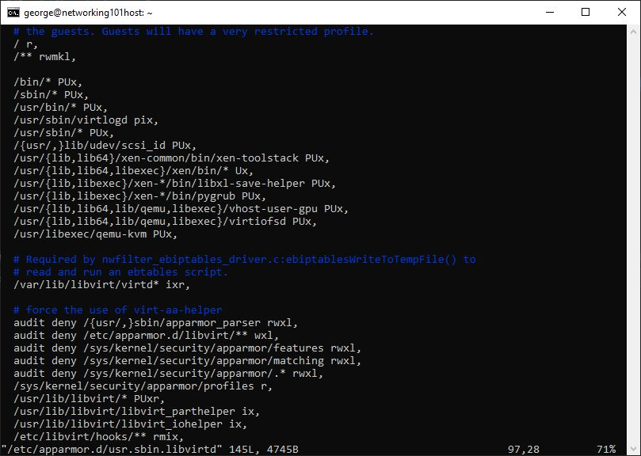

# Create The Ubuntu Host

In this walk-through, we will create the Linux host using the Ubuntu
distribution, and then install the virtualization stack. The virtualization
stack allows us to create virtual machines within the host.

### Installing Ubuntu

- Download the latest Ubuntu Desktop LTS ISO version from its download page
  here: [https://ubuntu.com/download/desktop](https://ubuntu.com/download/desktop).
- If installing on:
  - **a physical machine**, burn the downloaded ISO file unto a CD
    or a flash drive (you can use [Rufus](https://rufus.ie/en/) to do that).
  - **a virtual machine** on Hyper-V/Windows, follow the instructions
    [here](./create-ubuntu-vm.md).
- Follow the Ubuntu installer prompts until installation is complete.
- Start a Terminal window and follow the steps below.

### Install Utilities

```bash
sudo apt update
sudo apt install net-tools
sudo apt-get --assume-yes install openssh-server vim tar wget curl gawk
sudo apt-get update
```

### Install and Configure The Virtualization Stack

If the hardware does not support virtualization, the virtual machines will be
very slow. This is common if the Ubuntu machine is a virtual machine where
its host does not expose the virtualization hardware support to the virtual
machine. If that is the case, check how to expose the hardware support to guest
virtual machines.

To check the hardware virtualization support, run:

```bash
grep --color vmx /proc/cpuinfo
```

If the output contains `vmx`, then the hardware support for virtualization is
available.

Install libevirt, qemu, etc:

```bash
sudo apt-get --assume-yes install qemu-utils qemu-kvm libvirt-daemon-system libvirt-clients bridge-utils
sudo adduser $USER libvirt
sudo adduser $USER kvm
sudo apt-get --assume-yes install virt-manager
```

Configure qemu:

```bash
sudo ln -s /usr/bin/qemu-system-x86_64 /usr/libexec/qemu-kvm

# uncomment user and group so that they are equal to root.
# search for #user and #group
sudo vim /etc/libvirt/qemu.conf
```



Configure AppArmore:

```bash
sudo vim /etc/apparmor.d/usr.sbin.libvirtd
# under the '# Very lenient profile for...' add:
  /usr/libexec/qemu-kvm PUx,
```



### Install xrdp

This step is not required, but I have found it convenient to remotely use the
Ubuntu UX.

```bash
# Install xrdp client
sudo apt-get --assume-yes install xrdp
sudo adduser xrdp ssl-cert
sudo systemctl restart xrdp
```

### Reboot

```bash
sudo reboot
```

----

[Basic Setup](../basic-setup.md)